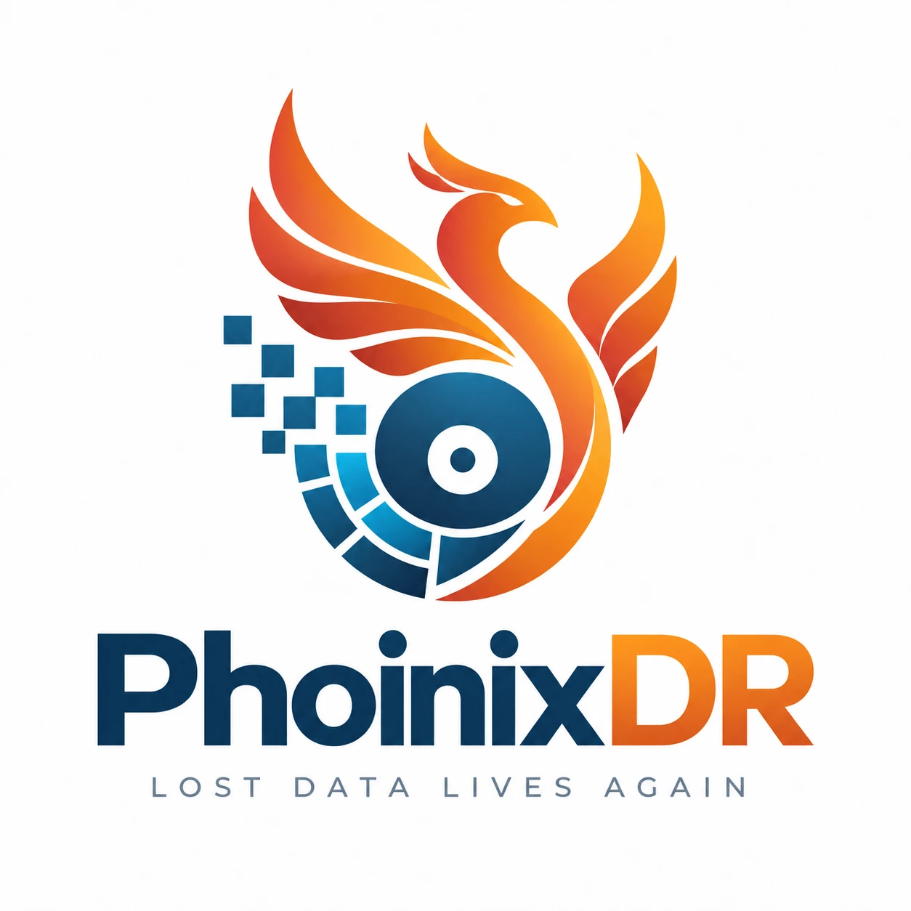

<p align="center">
  
</p>

<p align="center"><strong>Open Source Data Recovery · by <a href="https://github.com/pcoronaf">@pcoronaf</a></strong><br>
Lost data lives again. Recover lost files. Understand your chances.</p>

<p align="center">
  <a href="https://github.com/pcoronaf/PhoinixDR/releases/latest/download/PhoinixDR-windows-x64-portable.exe">Download for Windows</a> ·
  <a href="https://github.com/pcoronaf/PhoinixDR/releases/latest">Other platforms</a> ·
  <a href="https://pcoronaf.github.io/PhoinixDR/">Website</a> ·
  <a href="docs/README.md">Documentation</a> ·
  <a href="docs/user-guide/desktop.md">User guide</a> ·
  <a href="CHANGELOG.md">Changelog</a>
</p>

PhoinixDR (PHOINIX Data Recovery) is a data-recovery engine, command-line
tool and desktop application that reconstructs lost data from filesystems,
raw media, disk images and damaged storage structures while explaining how
likely each recovered object is to be intact.

```text
Select source → Scan → Find lost data → Assess recoverability → Preview → Recover
```

> **Status:** early engineering preview. The repository implements milestones
> M0–M11 of the technical specification: the read-only block layer, MBR/GPT
> discovery, native NTFS, FAT12/16/32, exFAT and ext2/3/4 readers with
> undelete (journal-assisted on ext3/ext4), deep
> scan (signature carving of unallocated space), lost-partition recovery
> (virtual mounts, no table writes), forensic and virtual-disk image
> containers (E01, split E01, split RAW, VHD, VHDX, VMDK) with hash
> verification and exportable recovery reports, evidence-based recovery
> health, a verified recovery writer, the `phoinix` CLI and a desktop
> application (Tauri 2 + React) with sessions, previews and recovery.

## About the project

- [Where PHOINIX Came From](docs/about/origin.md): why a complete, modern
  recovery platform rather than another utility or a front-end for
  TestDisk, and why no code is copied from existing projects.
- [Development Declaration](docs/about/development-declaration.md): how
  AI-assisted development is used, and why that is never taken as evidence
  of correctness.
- [Yes, PHOINIX is vibecoded](docs/about/vibecoded.md): *Vibecode the
  implementation. Engineer the system. Verify the result.*

## Download and run

The standard Windows release is a **single portable executable**: no
installation, no separately installed dependencies, only the WebView2
runtime that ships with Windows 10 (21H2+) and Windows 11
([requirement REL-001](docs/release/windows-portable.md)). Get it from the
[latest release](https://github.com/pcoronaf/PhoinixDR/releases/latest)
together with the command-line `phoinix.exe`, the Linux tarball and
`SHA256SUMS.txt`. Run it as administrator to scan physical disks; disk
images need no elevation. See [getting started](docs/getting-started.md).

## Principles

- **Read-only by default.** The block abstraction has no write primitive. No
  crate in the recovery core can modify source media.
- **Recovery methods stay independent.** Undelete, carving, filesystem
  reconstruction and partition reconstruction produce different evidence and
  different confidence.
- **Filesystem knowledge lives in filesystem crates.** NTFS rules never leak
  into generic recovery logic.
- **Every score is explainable.** Recovery likelihood and assessment
  confidence are separate numbers, and each is traceable to concrete evidence.
- **The core is independent of any GUI.** The same engine drives the CLI,
  tests, and the desktop application.
- **Third-party libraries sit behind adapters.**

See [`docs/architecture/overview.md`](docs/architecture/overview.md), the
[architectural decision records](docs/decisions/), the
[NTFS reader notes](docs/ntfs/reader.md), the
[FAT/exFAT engine notes](docs/fat/reader.md), the
[ext2/3/4 engine notes](docs/ext/reader.md), the
[deep scan / carving notes](docs/carving/deep-scan.md), the
[lost-partition recovery notes](docs/partition/recovery.md), the
[image container notes](docs/images/containers.md), the
[desktop architecture](docs/desktop/architecture.md), the
[health model](docs/recovery/health-model.md), the
[undelete corpora](docs/ntfs/undelete-corpus.md), the
[real-hardware test procedure](docs/testing/real-hardware.md) and the
[FAQ](docs/faq.md).

## Repository layout

```text
apps/phoinix-cli        command-line application
apps/desktop            desktop application: Tauri 2 shell (src-tauri) + React/TypeScript front-end
crates/phoinix-core     identifiers, byte ranges, checked arithmetic, byte parsing helpers, CRC-32C
crates/phoinix-block    read-only BlockReader, RAW images, subrange views, fingerprints
crates/phoinix-device   physical device enumeration and read-only access (Linux, Windows)
crates/phoinix-image    image containers (EWF/E01, split RAW, VHD, VHDX, VMDK) and hash verification
crates/phoinix-volume   MBR / extended MBR / GPT discovery and partition views
crates/phoinix-fs       filesystem-neutral contracts: probes, recovery candidates
crates/phoinix-fs-ntfs  native NTFS reader and undelete engine
crates/phoinix-fs-fat   native FAT12/16/32 reader and undelete engine
crates/phoinix-fs-exfat native exFAT reader and undelete engine
crates/phoinix-fs-ext   native ext2/3/4 reader, jbd2 journal reader and undelete engine
crates/phoinix-health   recovery evidence model, scoring and explanations
crates/phoinix-carve    deep scan: signature carving with structural assembly
crates/phoinix-recovery recovery writer with destination safety, SHA-256 verification and reports
crates/phoinix-partition-recovery  lost-partition search: boot sectors and superblocks, virtual mounts
crates/phoinix-session  application service layer: scans with progress, sessions, recovery, previews
tests/fixtures          compressed disk-image fixtures with ground-truth manifests
tests/generated         scripts that build the fixtures deterministically
tests/integration       end-to-end tests across crates
docs/                   guides, architecture, filesystem notes, decision records
site/                   the project website (GitHub Pages); docs are rendered into it
assets/                 logo
```

## Building

PhoinixDR is a standard Cargo workspace on stable Rust (edition 2024).

```bash
cargo build --release
cargo test --workspace
```

## Desktop application

```bash
cd apps/desktop
npm ci
npm run tauri dev                                     # development window
npm run build && cargo build --release --manifest-path src-tauri/Cargo.toml   # single portable executable
npm run tauri build                                   # optional installers under src-tauri/target/release/bundle
```

Linux needs the WebKitGTK development packages first
(`libwebkit2gtk-4.1-dev libgtk-3-dev libayatana-appindicator3-dev librsvg2-dev`).
Scanning physical disks requires an elevated process; disk images do not.
See [`docs/desktop/architecture.md`](docs/desktop/architecture.md) and the
[desktop guide](docs/user-guide/desktop.md).

## Using the CLI

```bash
# Enumerate physical block devices (may require elevated privileges).
phoinix devices

# Identify partition table, filesystems and image container of a source.
phoinix inspect disk.img
phoinix inspect case.E01 --json

# Verify an image's stored hashes (E01) or document its hashes.
phoinix verify case.E01

# Native NTFS reader.
phoinix ntfs info volume.img
phoinix ntfs ls volume.img
phoinix ntfs record volume.img 5
phoinix ntfs extract volume.img --record 64 --output file.bin

# Undelete: list deleted candidates with recovery health.
phoinix scan disk.img --deleted

# Deep scan: also carve files by signature from the unallocated space
# (--carve-all for the whole volume; works on raw sources without a filesystem).
phoinix scan disk.img --deep
phoinix scan disk.img --deep --carve-types jpeg,pdf,docx

# Lost partitions: find volumes by their structures, then scan one virtually.
phoinix partitions disk.img
phoinix scan disk.img --lost 2
phoinix recover disk.img --lost 2 64 --output /mnt/recovery

# Explain the evidence behind a candidate's score (carved files are c<offset>).
phoinix explain disk.img 64
phoinix explain disk.img c1048576

# Recover candidates to another filesystem and verify by SHA-256.
phoinix recover disk.img 64 65 c1048576 --output /mnt/recovery --preserve-tree

# Recover with a report (.html, .md or .json) and case metadata.
phoinix recover case.E01 64 --output /mnt/recovery --report /mnt/recovery/report.html \
    --case-number 2026-017 --examiner "J. Doe" --verify-source
```

Example `scan` output on the test corpus:

```text
ID   NAME                 SIZE      RECOVERY         CONF  PATH
68   tiny.txt             20 B      Excellent 97     82    \a\tiny.txt
77   photo.jpg            61.6 KiB  Excellent 95     97    \docs\photo.jpg
83   realloc_25.bin       256 KiB   Poor 59          82    \d\realloc_25.bin
87   wiped.jpg            61.6 KiB  Very poor 20     82    \g\wiped.jpg
96   document.txt         2.0 KiB   Very good 92     82    \?\document.txt
122  frag10.bin           640 KiB   Very good 87     82    \c\frag10.bin
```

`explain` lists the evidence behind each figure, for example
"16 of 64 required clusters are currently allocated to active filesystem
data" or "The JPEG image structure validates successfully".

`scan`, `explain` and `recover` detect the volume's filesystem (NTFS, FAT12/16/32,
exFAT or ext2/3/4) and use the matching engine. Every command accepts a
forensic or virtual-disk image (E01 and split E01, split RAW, VHD, VHDX,
VMDK) in place of a RAW image. When a source contains a partition
table they operate on the first supported partition by default; pass
`--partition N` to choose another, or point them at a bare volume image.
The [command-line guide](docs/user-guide/cli.md) covers every option.

## Safety

PhoinixDR never writes to the source. Recovery always targets another
filesystem, and the recovery writer refuses destinations that appear to live
on the source device. See [SECURITY.md](SECURITY.md) for the threat model and
how to report vulnerabilities.

## Community

[Issues](https://github.com/pcoronaf/PhoinixDR/issues) ·
[Discussions](https://github.com/pcoronaf/PhoinixDR/discussions) ·
[Contributing](CONTRIBUTING.md) ·
[Code of conduct](CODE_OF_CONDUCT.md) ·
[Security policy](SECURITY.md)

## License

SPDX-License-Identifier: `MIT OR Apache-2.0`

Licensed under either of

- Apache License, Version 2.0 ([LICENSE-APACHE](LICENSE-APACHE))
- MIT license ([LICENSE-MIT](LICENSE-MIT))

at your option. The Apache licence supplies the patent grant; the MIT
licence keeps compatibility with projects that prefer a minimal permissive
licence. Optional adapters for third-party libraries (for example
The Sleuth Kit or libewf) may carry different terms and are reviewed
dependency by dependency before any binary that includes them is released.
