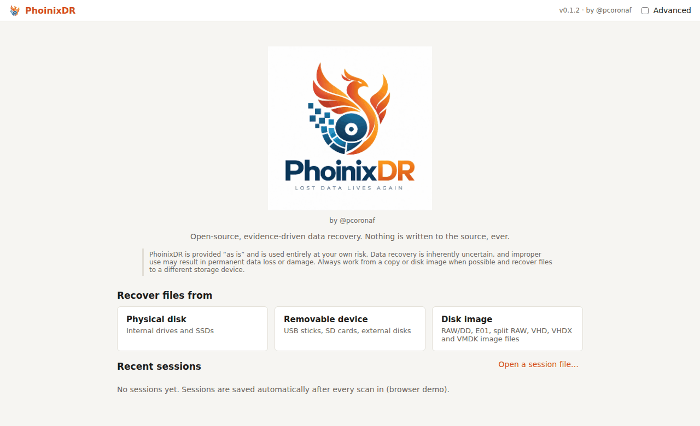
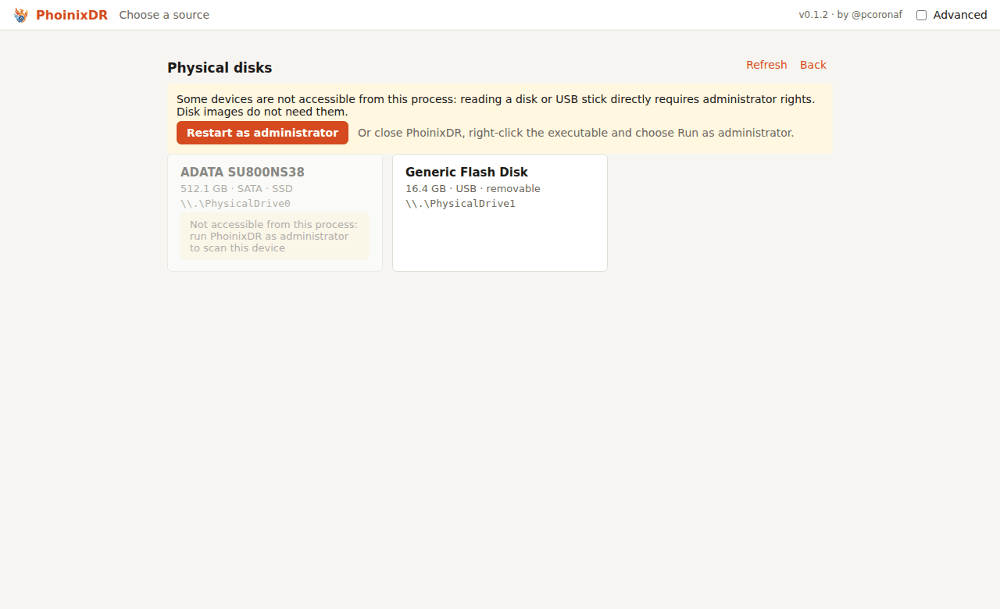
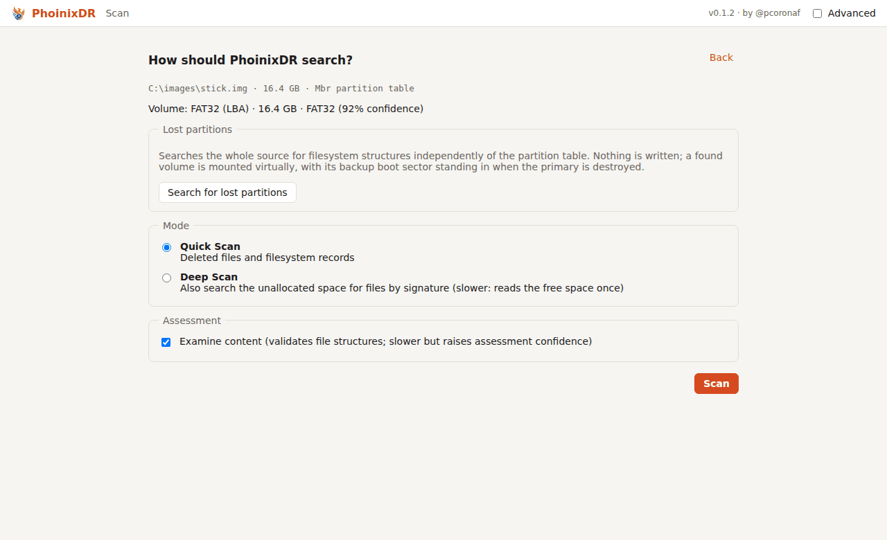
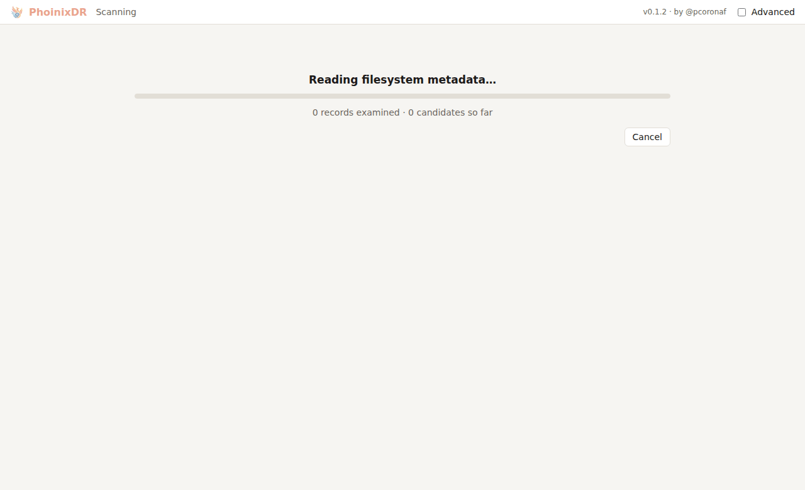
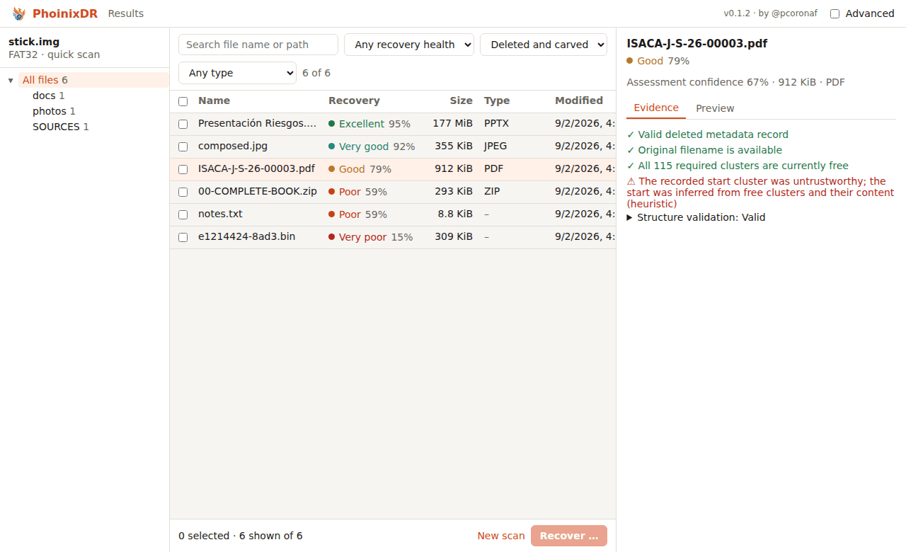
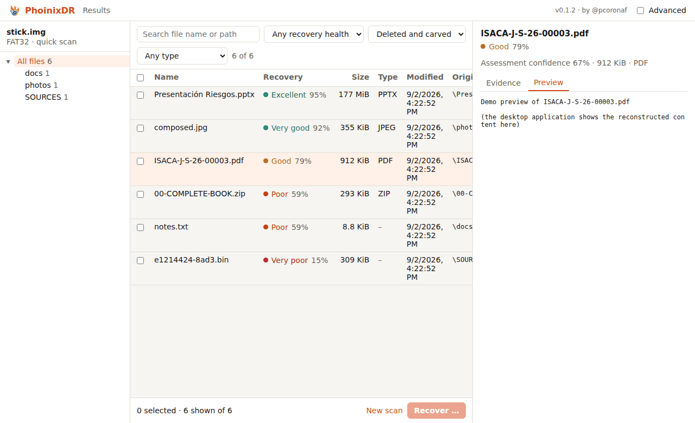
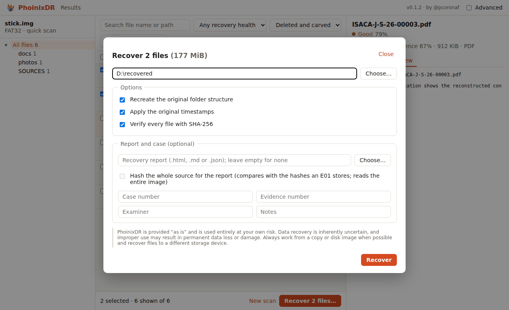
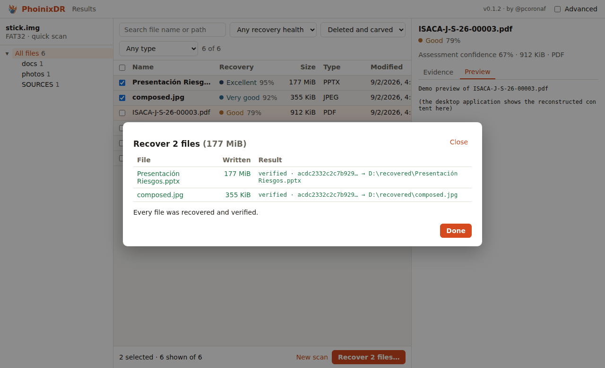
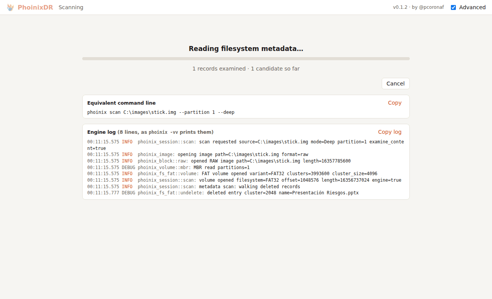
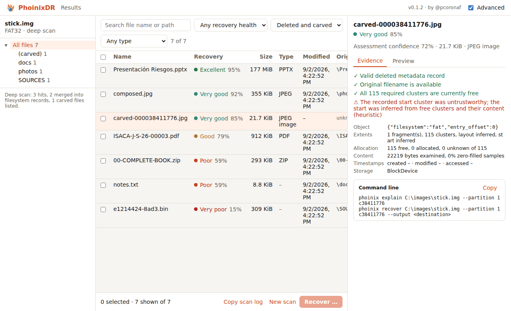

# Desktop guide

PhoinixDR's desktop application walks through the same steps as the
command line: choose a source, scan, understand what was found, preview,
recover. It never writes to the source.

## Starting

<figure>
  
  <figcaption>The home page: choose a physical disk, a removable device or a disk image; recent sessions are listed below.</figcaption>
</figure>

- **Windows:** run `PhoinixDR-<version>-windows-x64-portable.exe`. Nothing is
  installed (see [Windows portable release](../release/windows-portable.md)).
  To scan a physical disk or a USB stick, right-click the executable and
  choose *Run as administrator*; disk images do not need that.
- **Linux:** run `phoinix-desktop`; physical devices need `sudo` or a
  udev rule that grants read access to the disks.

The home page shows the version and author in the top bar and lists recent
scan sessions.

## Two ways to recover

PhoinixDR can work on the device itself or on an image of it. Pick one
before you start; the desktop guide below applies to both:

1. **Directly from the device, in one step.** Choose *Physical disk* or
   *Removable device*; when the device shows as not accessible, press
   **Restart as administrator** and accept the system prompt (or start
   PhoinixDR elevated yourself: Windows right-click, *Run as
   administrator*; Linux `sudo`). Then scan and recover. Fastest; PhoinixDR only ever reads from the device.
2. **From a disk image.** First make an image of the device with an
   imaging tool (FTK Imager or Arsenal Image Mounter on Windows, `dd`
   or `ewfacquire` on Linux) and then open the image file in PhoinixDR
   with *Disk image*. PhoinixDR itself needs no elevation for this; the
   imaging tool does, since it reads the same raw device. This is the
   recommended path for a failing drive, for anything you may need to
   examine again, and for forensic work (E01 hashes are verified and
   reported).

Both paths give the same results on a healthy device. In both, recover to
a different disk than the one you are recovering from.

## 1. Choose a source

<figure>
  
  <figcaption>The device picker. A disk that cannot be opened is greyed out and the notice offers to restart with administrator rights.</figcaption>
</figure>

| choice | what it lists |
|---|---|
| **Physical disk** | internal drives and SSDs |
| **Removable device** | USB sticks, SD cards, external disks |
| **Disk image** | a file: RAW/dd, split RAW, E01 (and split E01), SMART, VHD, VHDX, VMDK |

A device that cannot be opened is shown greyed as *Not accessible from
this process*, and a notice offers **Restart as administrator**: PhoinixDR
asks the system for elevation (the Windows UAC prompt, the polkit password
dialog on Linux) and starts an elevated copy of itself. On Windows the
current window closes as soon as the new one starts; on Linux it stays
open until the new window appears. Declining the prompt leaves the current
window as it was. The same notice appears on the home page when no device
can be listed at all. Starting the executable with *Run as administrator*
or `sudo` yourself works too. Disk images never need elevation.

## 2. Scan setup

<figure>
  
  <figcaption>Scan setup: the detected volume, the lost-partition search, Quick or Deep Scan, and content examination.</figcaption>
</figure>

The setup page shows the source, its partition table and every volume with
its filesystem and detection confidence.

- **Image container** (image files only): format, variant, segment count,
  compression, the acquisition header of an E01 (case number, examiner,
  dates, software), stored hashes, and a **Verify hashes** button that
  reads the whole image and compares its MD5/SHA-1 with the stored ones.
- **Volume:** pick a partition when the source has several.
- **Lost partitions:** *Search for lost partitions* scans the whole source
  for filesystem structures independently of the table. A found volume can
  be selected and is mounted virtually; when its primary boot sector is
  destroyed the backup is used in memory. The partition table is never
  modified.
- **Mode:** *Quick Scan* reads filesystem metadata (deleted files and
  records). *Deep Scan* also carves the unallocated space for files by
  signature; it reads the free space once. Volumes without a recognised
  filesystem can only be deep-scanned.
- **Deep scan options:** carve the whole volume instead of only the free
  space; restrict the file types.
- **Assessment:** *Examine content* validates file structures (JPEG, PNG,
  PDF, ZIP/DOCX, …) and raises assessment confidence; turning it off is
  faster.

## 3. Scanning

<figure>
  
  <figcaption>Scanning: phase, counts and throughput, with a Cancel button that keeps partial results.</figcaption>
</figure>

Progress shows the phase (metadata, carving), counts and throughput. The
scan can be cancelled; partial results are kept.

## 4. Results

<figure>
  
  <figcaption>Results: every candidate with its recovery health; the panel on the right lists the evidence behind the selected file's numbers.</figcaption>
</figure>

Every row is a recovery candidate:

| column | meaning |
|---|---|
| name | original name, or a synthetic `carved-…` name for carved files |
| health | **likelihood** that recovery returns the original bytes, with its category (Excellent … Unrecoverable), and **confidence** in that estimate |
| size | logical size when known |
| type | detected or expected file type |
| path | original path; `(uncertain)` when the directory record was reused; `journal` and `carved` tags say how the file was found |

Filters narrow the list by text, health category, type and origin
(metadata or carved). Selecting a row opens the detail panel:

- the **evidence**: every positive and negative reason behind the two
  numbers, and diagnostics such as reused clusters, journal transactions
  or inferred starts;
- a **preview**: images are rendered, text is shown, other content is
  hex-dumped; previews read the source, never write it.

Read the evidence before trusting a number. "Allocated to active
filesystem data" means the clusters have been reused, not that every
byte is gone; "Unrecoverable" means no extent of the content could be
located, in which case a deep scan may still carve it.

<figure>
  
  <figcaption>The Preview tab renders images and text and hex-dumps other content, reading only from the source.</figcaption>
</figure>

## 5. Recovery

<figure>
  
  <figcaption>The Recover dialog: destination on another disk, options, and the optional report and case fields.</figcaption>
</figure>

Select rows and press **Recover**:

- **Destination:** a directory on another disk. A destination on the
  source disk is refused; the expert override is for people who know they
  are risking the data they are recovering. A destination that is the
  image file itself is always refused.
- **Options:** recreate the original folder structure, apply original
  timestamps, verify every file with SHA-256.
- **Report and case (optional):** choose a report file (`.html`, `.md` or `.json`),
  optionally hash the whole source for it, and fill in case number,
  evidence number, examiner and notes. Fields are prefilled from the E01
  acquisition header when the source has one.

The result table shows every file with bytes written, `verified` or
`PARTIAL`, the SHA-256 prefix and the output path. The report path is
shown when one was written.

<figure>
  
  <figcaption>After recovery: bytes written, verification state and output path for every file.</figcaption>
</figure>

## Advanced mode

The **Advanced** checkbox in the top bar shows the technical detail behind
the interface. It changes nothing about the scan or the recovery.

<figure>
  
  <figcaption>Scanning in Advanced mode: the equivalent command line above the live engine log.</figcaption>
</figure>

- **Equivalent command line.** While a scan runs, the page shows the
  `phoinix scan …` command that reproduces it, with the same source,
  partition, mode and carving options. In the results, the detail panel
  shows the `phoinix explain` and `phoinix recover` commands for the
  selected file. Every command has a *Copy* button.
- **Engine log.** The same records the command line prints with `-vv`:
  which image or device was opened, the filesystem found, how many records
  were walked, the carving pass, and the counts at the end. The log is
  forwarded from the engine only while Advanced is on; it is never
  written to disk by the desktop application and never contains recovered
  content. *Copy log* puts it on the clipboard for a bug report, and the
  results page keeps *Copy scan log* available afterwards.
- **In the results:** a *Ref* column with the candidate's filesystem
  reference (the value the commands above use), the structure validation
  checks expanded, and a diagnostics block with the raw evidence (object,
  extents, allocation, content samples, timestamps, storage).

<figure>
  
  <figcaption>Results in Advanced mode: the Ref column, the diagnostics block and the command lines for the selected file.</figcaption>
</figure>

## Sessions

Every scan is saved as a session (`.phx`) in the application data
directory and listed on the home page. Reopening a session reopens the
source at the same volume (repairs included) so previews and recovery
work later without rescanning. Sessions can be opened from any path with
*Browse…*.

## Privacy

The application does not contact the network. Logs (`-v` on the command
line, none in the desktop) never contain recovered content.
